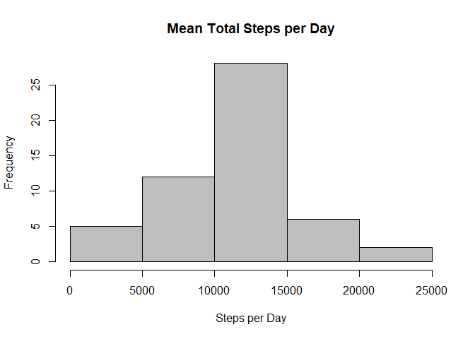
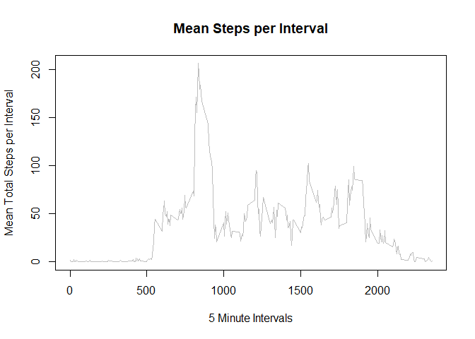
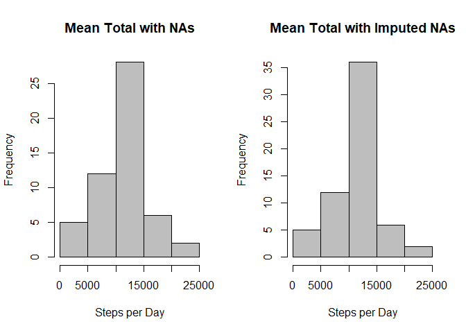
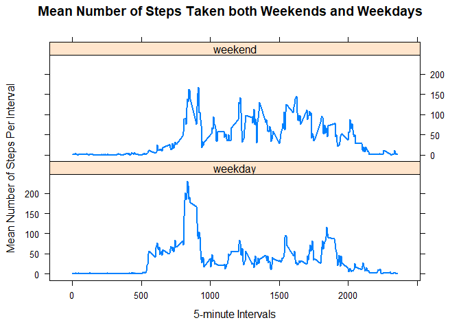

Loading and Preprocessing the Data
----------------------------------

Downloading, unzipping, and loading the data:

``` r
if(!file.exists("activity.csv")) {
      tempfile <- tempfile()
      download.file("http://d396qusza40orc.cloudfront.net/repdata%2Fdata%2Factivity.zip",destfile = tempfile)
      unzip(tempfile)
      unlink(tempfile)
}

Adata <- read.csv("activity.csv")
```

Taking a look at the summary and structure of the loaded data:

``` r
summary(Adata)
```

    ##      steps                date          interval     
    ##  Min.   :  0.00   2012-10-01:  288   Min.   :   0.0  
    ##  1st Qu.:  0.00   2012-10-02:  288   1st Qu.: 588.8  
    ##  Median :  0.00   2012-10-03:  288   Median :1177.5  
    ##  Mean   : 37.38   2012-10-04:  288   Mean   :1177.5  
    ##  3rd Qu.: 12.00   2012-10-05:  288   3rd Qu.:1766.2  
    ##  Max.   :806.00   2012-10-06:  288   Max.   :2355.0  
    ##  NA's   :2304     (Other)   :15840

``` r
str(Adata)
```

    ## 'data.frame':    17568 obs. of  3 variables:
    ##  $ steps   : int  NA NA NA NA NA NA NA NA NA NA ...
    ##  $ date    : Factor w/ 61 levels "2012-10-01","2012-10-02",..: 1 1 1 1 1 1 1 1 1 1 ...
    ##  $ interval: int  0 5 10 15 20 25 30 35 40 45 ...

Transforming the date into a date format instead of a factor:

``` r
Adata$date <- as.Date(Adata$date, format = "%Y-%m-%d")
```

What is mean total number of steps taken per day?
-------------------------------------------------

Calculating the mean total number of steps per day while also removing the NA values. Mean is 10766 from the summary data:

``` r
StepsPerDay <- aggregate(steps ~ date, data = Adata, FUN = sum, na.rm = TRUE)
summary(StepsPerDay)
```

    ##       date                steps      
    ##  Min.   :2012-10-02   Min.   :   41  
    ##  1st Qu.:2012-10-16   1st Qu.: 8841  
    ##  Median :2012-10-29   Median :10765  
    ##  Mean   :2012-10-30   Mean   :10766  
    ##  3rd Qu.:2012-11-16   3rd Qu.:13294  
    ##  Max.   :2012-11-29   Max.   :21194

Making a histogram of the number of steps per day:

``` r
hist(StepsPerDay$steps, xlab = "Steps per Day", main = "Mean Total Steps per Day", col = "gray")
```



Reporting the mean and median of the total number of steps per day:

``` r
mean(StepsPerDay$steps)
```

    ## [1] 10766.19

``` r
median(StepsPerDay$steps)
```

    ## [1] 10765

What is the Average Daily Activity Pattern?
-------------------------------------------

Making a time series plot of the 5 minute intervals and the averaged number of steps taken, averaged across all days:

First, I aggregate the data.

``` r
ActivityIntervalMean <- aggregate(steps ~ interval, data = Adata, FUN = mean, na.rm = TRUE)
```

Then, I plot.

``` r
plot(ActivityIntervalMean$interval, ActivityIntervalMean$steps, type = "l", col = "gray",
     xlab = "5 Minute Intervals", ylab = "Mean Total Steps per Interval",
     main = "Mean Steps per Interval")
```



To answer which 5 minute interval contains the maximum number of steps, I first determine the maximum number of steps, then find the interval that holds that many steps, we see that the maximum number of steps is 206.1698 and is performed on the interval that starts on the 835th minute of that day.

``` r
MaxSteps <- max(ActivityIntervalMean$steps)
print(MaxSteps)
```

    ## [1] 206.1698

``` r
ActivityIntervalMean$interval[which(ActivityIntervalMean$steps == MaxSteps)]
```

    ## [1] 835

Imputing Missing Values
-----------------------

First I take a look at the number of number NA values.

``` r
sum(is.na(Adata))
```

    ## [1] 2304

Then I choose to impute the missing values with the average of the steps taken on that specific interval. This also creates a new dataset that is equal to the original dataset but with imputed values.

``` r
Imputed <- Adata
for (i in ActivityIntervalMean$interval) {
      Imputed[Imputed$interval == i & is.na(Imputed$steps), ]$steps <- 
            ActivityIntervalMean$steps[ActivityIntervalMean$interval == i]
}
```

To check that the values have been imputed, I check the number of NA values again.

``` r
sum(is.na(Imputed))
```

    ## [1] 0

Lets plot this new dataset (with imputed values) against the old (without the imputed values) to see if there is a large difference.

``` r
par(mfrow = c(1,2))

StepsPerDay <- aggregate(steps ~ date, data = Adata, FUN = sum, na.rm = TRUE)
hist(StepsPerDay$steps, xlab = "Steps per Day", main = "Mean Total with NAs", col = "gray")

ImpStepsPerDay <- aggregate(steps ~ date, data = Imputed, FUN = sum, na.rm = TRUE)
hist(ImpStepsPerDay$steps, xlab = "Steps per Day", main = "Mean Total with Imputed NAs", col = "gray")
```



It doesn't look like there is a huge difference, but lets make sure by looking at the mean and median of each.

``` r
mean(ImpStepsPerDay$steps)
```

    ## [1] 10766.19

``` r
mean(StepsPerDay$steps)
```

    ## [1] 10766.19

``` r
median(ImpStepsPerDay$steps)
```

    ## [1] 10766.19

``` r
median(StepsPerDay$steps)
```

    ## [1] 10765

It looks like the difference of imputed and non-imputed means and medians is very small, and the impact of any difference by using imputation is negligible.

Are there differences in activity patterns between weekdays and weekends?
-------------------------------------------------------------------------

This creates a new factor called daytype based on whether the day of the week falls on a weekday or a weekend

``` r
wk <- Imputed
weekend <- weekdays(as.Date(wk$date)) %in% c("Saturday", "Sunday")
wk$daytype <- "weekday"
wk$daytype[weekend == TRUE] <- "weekend"
wk$daytype <- as.factor(wk$daytype)
str(wk)
```

    ## 'data.frame':    17568 obs. of  4 variables:
    ##  $ steps   : num  1.717 0.3396 0.1321 0.1509 0.0755 ...
    ##  $ date    : Date, format: "2012-10-01" "2012-10-01" ...
    ##  $ interval: int  0 5 10 15 20 25 30 35 40 45 ...
    ##  $ daytype : Factor w/ 2 levels "weekday","weekend": 1 1 1 1 1 1 1 1 1 1 ...

Lastly, here is a panel plot with 2 panels containing a time series plot of the 5-minute interval (x-axis) and the average number of steps taken, averaged across all weekday days or weekend days (y-axis).

``` r
Avg <- aggregate(steps ~ interval + daytype, data = wk, mean)
library(lattice)
xyplot(steps ~ interval | daytype, data = Avg, type = "l", lwd = 2,
       layout = c(1, 2), 
       xlab = "5-minute Intervals", 
       ylab = "Mean Number of Steps Per Interval",
       main = "Mean Number of Steps Taken both Weekends and Weekdays")
```



From looking at the two plots, the data suggests there is more activity occuring earlier on weekdays. On weekends, it looks like there is higher sustained activity.
